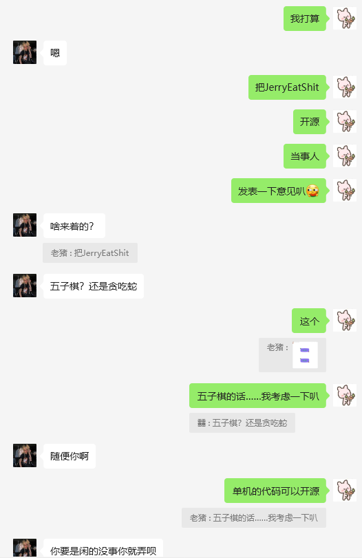

# 一个贪吃蛇游戏
### 简介
这是一个由小猪开发的贪吃蛇游戏，是小猪初二时闲来无事时写的小游戏，由于当时小猪很菜，所以代码写的不好，还请见谅。 
这个仓库主要是高中之后为了纪念初中那段无忧无虑coding的日子而创建 
 
# 注意事项 
* #### 本仓库采用Apache协议，需保留代码中的作者信息 
* 程序依靠pygame实现，需要在运行前运行<code>pip install pygame</code>安装pygame库才能正常运行
 
# 玩法 

### 规则 
* Jerry吃掉Shit可以加分 
* 分数达到30分即为成功 
* 炼狱模式下Jerry一段时间未吃到Shit后会以每秒0.1分的速度减分 
* 有概率出现绿屎，Jerry吃到后会加更多分数
* Jerry吃到自己的尾巴或碰壁会输掉游戏

### 控制方法 
## 单人模式 
* ↑↓←→控制Jerry吃到Shit 
## 双人模式
* WASD控制Shit躲避Jerry，每隔60SShit可以获得10S的加速，按下Q使用

# 为什么要做这个游戏
小猪有一个长得很像《Tom and Jerry》中Jerry的兄弟，他是小猪的初中同学，当时学校举办校运会，小猪并没有参加，于是在班级里面写题，之后看到班里面的多媒体，感觉它风韵犹在、眉清目秀、亭亭玉立、秀色可餐，遂偷偷开机写下了这款软件
 